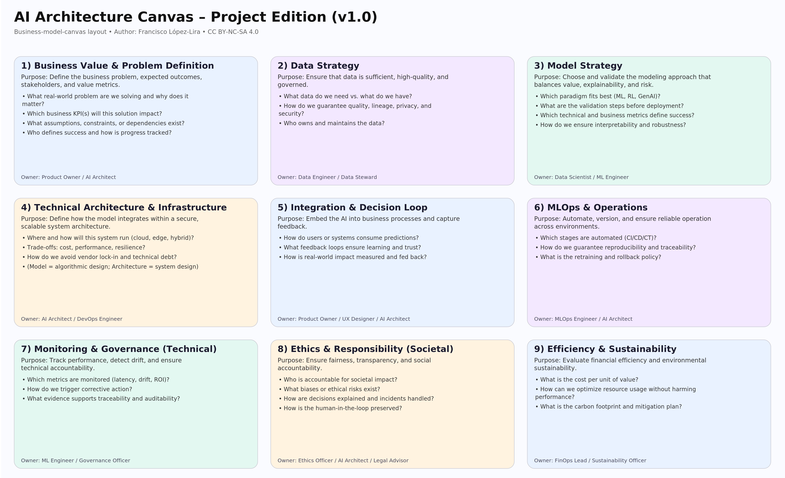

# 🧠 AI Architecture Canvas — Open Framework for Trustworthy AI Systems  
*by Francisco López-Lira*  
**License:** CC BY-NC-SA 4.0  

---

## 🎯 Purpose

The **AI Architecture Canvas** is a one-page framework for designing, reviewing, and governing AI systems that are **aligned with business value, technically sound, and ethically responsible**.

It acts as a bridge between business, data, modeling, infrastructure, and governance — a shared map for teams building anything from classical ML to Generative AI.

Think of it as the *Business Model Canvas*, but for AI projects.

---

## 🧩 Overview

Nine core blocks capture the full lifecycle of an AI system:

| # | Block | Core Question |
|:-:|:------|:---------------|
| 1 | **Business Value & Problem Definition** | Why are we building this AI, and what measurable value does it deliver? |
| 2 | **Data Strategy** | What data do we have, what do we need, and how do we ensure trust and compliance? |
| 3 | **Model Strategy** | Which modeling approach best balances value, explainability, and risk? |
| 4 | **Technical Architecture & Infrastructure** | How will the AI system be deployed, secured, and scaled? |
| 5 | **Integration & Decision Loop** | How will predictions influence real decisions? |
| 6 | **MLOps & Operations** | How do we automate, version, and maintain the lifecycle? |
| 7 | **Monitoring & Governance (Technical)** | How do we ensure reliability, drift detection, and traceability? |
| 8 | **Ethics & Responsibility (Societal)** | How do we ensure fairness, transparency, and accountability? |
| 9 | **Efficiency & Sustainability** | How do we maximize financial and environmental efficiency? |

---

## 📘 Documentation

- **[AI Architecture Canvas – Project Edition (v1.0)](docs/AI_Architecture_Canvas_v1.0.md)**  
  The core framework: goals, principles, and structure.  

- **[AI Architecture Canvas — Guide for AI Architects (v1.1 draft)](docs/AI_Architecture_Canvas_Guide_v1.1.md)**  
  Expands each block with checklists, deliverables, and anti-patterns.

---

## 🧠 How to Use It

- As a **design tool** for new AI initiatives.  
- As a **review checklist** for architecture boards.  
- As **documentation** for traceability and compliance.  

Each block can be customized to fit your organization’s governance or tooling stack.  

---

## 🔓 License

This project is released under **Creative Commons Attribution–ShareAlike 4.0 International (CC BY-SA 4.0)**.  
You are free to use, share, and adapt this framework — even commercially — as long as attribution is given to:

> *“AI Architecture Canvas – Project Edition (v1.0)” by Francisco López-Lira*

and any derivative work remains open under the same license.

[Read the full license text →](LICENSE)

---

## 🤝 Contributing

Contributions are welcome — improvements, examples, or new templates.  
Please:
1. Fork the repository  
2. Create a feature branch  
3. Submit a pull request with a short description  

All contributions will be shared under the same **CC BY-SA 4.0** license.

---

## 🧭 Versions

| Version | Date | Notes |
|:--------:|:------|:------|
| **v1.0** | 2025-10-18 | Public release of the AI Architecture Canvas |
| **v1.1** | (in progress) | Expanded Guide for AI Architects |

---

## 🌐 Related Resources
- [Author Profile](https://medium.com/@flopezlira)  
- [Creative Commons License](https://creativecommons.org/licenses/by-nc-sa/4.0/)  

---

> “Architecture isn’t just about how AI works — it’s about AI's fitness for purpose.”

